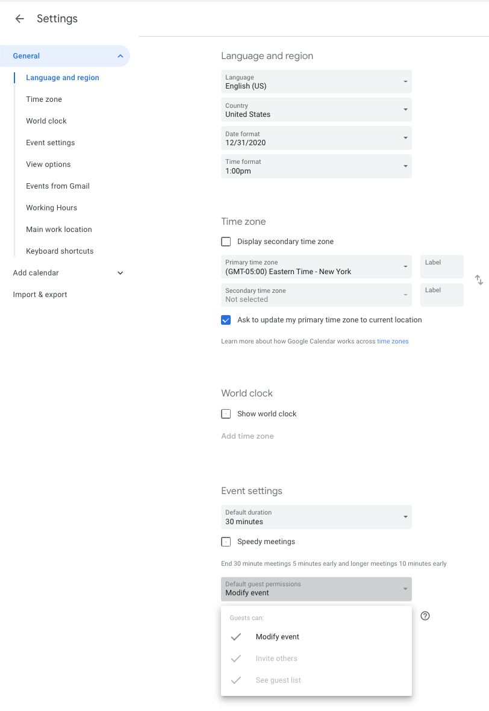

## Meetings

### Scheduling meetings
We schedule meetings via Google Calendar. Rooms can be booked via [YAROOMS](https://work-bench.yarooms.com/schedule/daily?location=11825) (ask Work-Bench staff for access).

On your Google Calendar, please enable Settings > Event Settings > Default Guest Permissions > Modify Events for easier rescheduling of meetings.

## Vacation and Out-of-Office
Take whatever PTO you need.

If you are taking so much PTO that you are missing your goals, then Nick + Dan will have a conversation with you about that. In general, we’re more concerned with people taking too little PTO than too much.

When you plan to be out of office, you should put it on [the OOO calendar](https://calendar.google.com/calendar?cid=d2luZG1pbGwuZW5naW5lZXJpbmdfcWduZ21paWtubjMzcm8xbWp1a3I0MDQ0cWdAZ3JvdXAuY2FsZW5kYXIuZ29vZ2xlLmNvbQ).

We review the next 3 weeks of the OOO calendar during planning. If your vacation isn’t marked, we may book things for you on the assumption that you’ll be here. Week-long vacations should be booked at least 3 weeks out, or as soon as you know about them.

For urgent issues, or 1-day vacations, we’re more flexible. They should still be on the OOO calendar.
