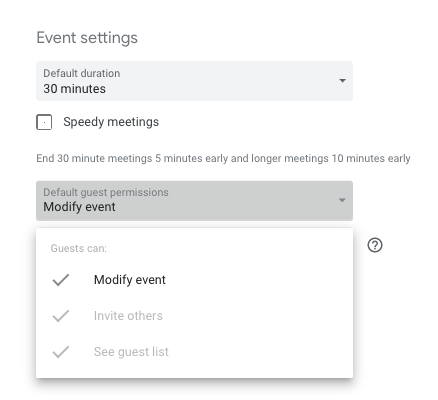

# Hours & Scheduling

We try to keep in-office quorum 11am-4pm NYC time (for meeting scheduling).

If you are not in the office for most of the day, you should put it on the OOO calendar and your own calendar.

## Meetings

We schedule meetings via Google Calendar.

On your Google Calendar, please enable Settings > Event Settings > Default Guest Permissions > Modify Events for easier rescheduling of meetings.

## Vacation and Out-of-Office

Take whatever PTO you need.

If you are taking so much PTO that you are missing your goals, then Nick + Dan will have a conversation with you about that. In general, we’re more concerned with people taking too little PTO than too much.

When you plan to be out of office, you should put it on [the OOO calendar](https://calendar.google.com/calendar?cid=d2luZG1pbGwuZW5naW5lZXJpbmdfcWduZ21paWtubjMzcm8xbWp1a3I0MDQ0cWdAZ3JvdXAuY2FsZW5kYXIuZ29vZ2xlLmNvbQ) and your own calendar.

We review the next 3 weeks of the OOO calendar during planning. If your vacation isn’t marked, we may book things for you on the assumption that you’ll be here. Week-long vacations should be booked at least 3 weeks out, or as soon as you know about them.

For urgent issues, or 1-day vacations, we’re more flexible. They should still be on the OOO calendar.

### Vacation Buddies

If you’re away for vacation for several days, you should find a vacation buddy
to catch you up when you get back. A good vacation buddy is someone who will be
in the office for the entire time that you are gone.

As the vacation buddy, a good way to keep the vacationer up-to-date is by
jotting down notes as they occur, perhaps in a Slack DM or another handy
channel. A recap chat with these notes as reference can also be helpful upon the
vacationer’s return.
