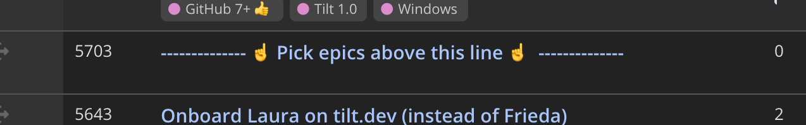

# Product Development

## Deadlines for major product releases
For major product releases, it may be helpful to establish a deadline, in order to help support account managers in communicating upcoming changes with customers, and in general, help them with general Tilt rollout plans. In particular:
- Victor is responsible identifying major product releases.
- Victor is responsible for establishing these deadlines, in close collaboration with Dan, Nick, and engineering folks in general, especially as it pertains to effort and timeline estimation.
- Victor is responsible for communicating these deadlines to all Tilters _internally_. Account managers are responsible for communicating downstream expectations to customers per their good judgment.
- Everyone should work together to avoid significantly delaying an established deadline, especially if downstream expectations have already been communicated to many customers.
- We should use the due date field on epics and stories to capture deadlines. We should apply the due dates to the final marketing deliverables (e.g. blog posts, docs), instead of product change deliverables, so that account managers are equipped with artifacts to share with customers.

## Encourage users to create and subscribe to GitHub issues
We use Clubhouse stories and epics to track product changes. But we rely on GitHub issues to engage with the Tilt community. In addition to the [Exterminator creating GitHub issues for feature requests](../user-support/README.md#exterminator), Tilters should encourage all users to create GitHub issues, subscribe to existing issues, and 👍 them. In particular, by subscribing to an issue, a user will get a notification when it is closed (possibly informing them that a feature request is now implemented), bringing them back to Tilt for further product discussion.

## Workflow
We have a lightweight product develoment workflow that empowers individual Tilters to collaboratively solve business problems, work directly with customers, and to be accountable for achieving positive business outcomes.


The workflow is summarized in the image above. At the far left, we continually have conversations with customers and the community. These are synthesized into GitHub issues and Clubhouse stories. Based on this feedback and our broader company goals and strategy, we maintain a backlog of high-level initiatives as Clubhouse epics (primarily product changes). Over time, epics are further defined with scoped work and acceptance criteria, as they are eventually implemented and shipped.

### Free-form discussion in Clubhouse stories
All Tilters are encouraged to collaborate in _discussing_ general ideas in a free-form fashion, with no strict process, no structure, no specific timelines, and no specific implementation commitments. Tilters should prefer discussing ideas in Clubhouse stories, linking ideas together, thus building a web of good ideas that are easily searchable for posterity.

### Defining high-level business initiatives with Clubhouse epics
All Tilters are encouraged to collaborate in _definining_ high-level business initiatives. Similar to general ideas, there is no strict process for collaboration, except that each business initiative should be documented as a Clubhouse epic. As an epic becomes increasingly well-defined over time, it should have more and more of these components with increasing fidelity:
- Problem statement
- Solution scope
- Attached stories with relevant ideas, including designs
- Link to specific metrics and/or charts that this change targets to improve

## Unstarted epics
By default, Victor is the owner of all unstarted epics. (There are some exceptions, such as unstarted devrel epics that are owned by L.) Victor is responsible for ensuring that the [backlog of unstarted epics](https://app.clubhouse.io/windmill/epics?state_ids=500008016&state_ids=500008001) is continually full and that epics are increasingly being better defined. There should be no shortage of epics.

If you have a question or comment about an unstarted epic's scope, design, timeline, priority, or any other aspect, you should direct it at Victor.

Once the epic is `In Progress`, Victor is no longer the owner. [The DRI becomes the epic owner.](#picking-an-epic-to-work-on)


## Prioritizing epics

Dan B and Nick, and Victor are responsible for maintaining the priority of the backlog (higher priority toward the top in the Clubhouse view, when the triangle is pointing down).

Before an epic is moved above the line:
1. Its description should contain the [epic description template](#epic-description-template).
2. The "Problem statement and references" section should be completed.

## Epic description template

Copy and paste the template below into the epic description, and update it accordingly. When a section is done, replace `:white_small_square:` with `:white_check_mark:` to indicate it is done (or explain why the section is not applicable).

```
---

# Acceptance criteria
See [Product Development](https://github.com/tilt-dev/company/blob/master/product-development/README.md) for details.

When a section is done, replace :white_small_square: with :white_check_mark:

## :white_small_square: Problem statement and references
- E.g. Tilt users find it difficult to understand the colors in the Tilt Web UI sidebar.
- See the customer conversations here:
  - Google doc
  - Slack conversation
  - Clubhouse story

## :white_small_square: Solution scope, final implementation, and demo
- E.g. We decided to add tooltips to all the different statuses in the sidebar.
- Screenshots, gifs, or video
- Scheduled a presentation of the epic and a demo of any new functionality. Can be in [weekly epics meeting](https://github.com/tilt-dev/company/blob/master/product-development/README.md#weekly-epics-meeting). Add your presentation and demo as [an agenda item here](https://docs.google.com/document/d/173tL_bu4hs73VXo5kHxU0rDSXFlmKS-gpMJokpcdWE0/).
- As a Tilt user, I should be able to experience this change (e.g. know how to use this new feature), after reading this section.


## :white_small_square: User Journey, if applicable
Example:
- As a Laura, I go to the Landing page and click on "Get Tilt for your Team"
- On the New Team page, I login to GitHub to sign up for Tilt Cloud
- [In Scope] On the Team dashboard, I copy the one-liner to my command line to install Tilt.
- [In Scope] Alternately: I click to download the correct binary for my OS
- [In Scope] Following instructions on the Team dashboard, I type tilt up in my project directory
- [Out of Scope] Tilt Web shows Friendly Onboarding on Tilt in the app, so I can set up my team without bouncing off to the tutorial.

## :white_small_square: Updated docs and blog posts, if applicable
- Links

## :white_small_square: Out of scope, related, and/or future work, if applicable
- E.g. Clubhouse story for adding additional new statuses and colors
- E.g. we are considering surfacing some of this status information to Tilt Cloud in real-time. See this Clubhouse story.

## :white_small_square: Follow up customer conversations, if applicable
- Reached out to customers who requested this feature (or expressed a related problem).
  - Links to Slack conversations.
  - Stating that a meeting has been scheduled with a customer to introduce the feature.

## :white_small_square: Metrics
- Link to specific metrics and/or charts that this change targets to improve.
- Many changes will not improve metrics in weeks or even months. That's okay. But still need to mention which specific metrics you are targeting.
- If your change introduces a new metric to measure, collecting that data should be in scope or future work should be captured. For example, if you've created a new feature, you should be tracking it with weekly feature-using accounts, and link to that metric here.
- Most changes should be small and thus you should be frequently linking to [Company Metrics](https://github.com/tilt-dev/company-private/tree/master/company-metrics) and [Tilt metrics](https://github.com/tilt-dev/company-private/tree/master/tilt-metrics).
- Refer to [Analytics](https://github.com/tilt-dev/company-private/tree/master/analytics) to determine how to collect metrics. Contact Victor if you're unsure how to use the analytics software or collect the data that you're interested in.
```

## Picking an epic to work on
When a Tilt engineer is free, they should [pick a high priority unstarted epic](#picking-a-high-priority-unstarted-epic) to work on, or join another engineer (or engineers) already working on an `In Progress` epic. (They might consider [fixing a bug instead](../development/README.md#assign-yourself-a-bug).) Engineers should self-organize and coordinate timelines ad hoc when picking epics. There are no stable teams, no timeboxed sprints, and no synced sprints across teams. Engineers should consider:
- Working in at least pairs on a given epic, to better facilitate product and code collaboration, avoiding working in siloes.
- Having a dedicated review Tilter per epic, who may be responsible for code review, content review and/or general deliverable review, who may not necessarily be collaborating during the design and implementation part of the epic, but is responsible for reviewing work.
- Not working on too many epics concurrently, in order to focus on a smaller number of tasks to reduce context-switching.

When you have picked an epic to work on, move it into the `In Progress` state. Remove any existing owner. Make yourself the owner. You are now the [DRI](https://medium.com/@mmamet/directly-responsible-individuals-f5009f465da4) for the epic, and are responsible for driving the epic to completion. An engineer should be the DRI of at most one `In Progress` epic at any time. An epic should only have one owner at any time.

Dan and Nick will typically not be DRIs on epics, in order to encourage all Tilters to have more responsibility for innovation and execution of day to day work.

## Picking a high priority unstarted epic
When picking a high priority unstarted epic, look at the epics _above the line_ in the [backlog](https://app.clubhouse.io/windmill/epics?state_ids=500008016&state_ids=500008001) and choose a sensible one based on at least these example scenarios:
- My skill set is better suited for the third highest priority epic, so I'll pick that one, and save the first two for other folks who can finish them more quickly.
- The fourth highest priority epic looks to be small so I'll pick that one first and finish it as a quick win before the end of the week.
- My teammate has expertise in the highest priority epic and I'd like to collaborate and learn from them. But they aren't free just yet. I'll work on the third highest priority epic for now and plan to come back to pair with my teammate next week.

Dan B and Nick, and Victor are responsible for setting the location of the line.

Victor is responsible for tracking [open customer requests](https://companies-b164c.firebaseapp.com/customer-requests) as an input for prioritization.



## Reducing scope
A given epic may have a fairly broad initial business problem. The engineer(s) should carve out and define a smaller problem, and spec out a solution that can be accomplished within a target of **_7 business days_** (counted from when the epic moves into `In Progress`, more below on states). If the solution cannot be finished within 7 business days, keep reducing scope. The epic description should be updated with the smaller scope and acceptance criteria, and the engineer(s) should create additional epics and/or stories to capture the future work. Alternatively, the engineer(s) may create a separate epic with the smaller scope and start work on that one instead (putting the original epic back into the backlog).

The target time period is business calendar time, regardless of how many folks are working on the epic. So if for unplanned circumstances a person in a two person epic needs to be pulled away, the remaining person (who should be the epic owner DRI) may reduce scope to try to meet the target time period due to reduced capacity, saving the unfinished work for a future epic.

The purpose of a single epic is _not_ to completely solve a business problem. Rather, completing an epic should likely achieve incremental progress at addressing a single problem, adding incremental user value as a result. In some cases, any realized user value may only appear in future epics.

Certain initiatives may require a sustained effort of multiple epics to get to a place where folks are comfortable with the result. Tilters should therefore advocate for epics that close the gap of new but incomplete functionality, or fix tech debt, as per the [advocacy process outlined above](#defining-high-level-business-initiatives-with-clubhouse-epics).

## Epic owner and epic states
- An epic is in one of three states: `Unstarted`, `In Progress`, `Closed`.
- If an epic is in `In Progress` or `Closed`, it must have exactly one owner, who is the DRI.

## DRI responsibilties
- The DRI is responsible for maintaining the epic state, description, and attached stories updated as the single source of truth of overall work status, at least on a daily basis.
- The acceptance criteria sections are _especially critical_, including presenting the problem and final implementation in the [weekly epics meeting](#weekly-epics-meeting).
- The DRI is responsible for reducing scope if additional work is discovered.
- The DRI is responsible for driving the epic to completion.

## Example
For example, suppose usability research suggests that the Tilt Web UI right sidebar is difficult for users to learn. Two engineers develop some ideas to iterate on the existing designs in order to address the problems. But they discover that it's a better idea to first re-architect some of the frontend JavaScript and CSS to accommodate the design changes, repaying some previously incurred tech debt. In this case, the first epic's scope would simply be non-user facing code re-architecture work, that doesn't have immediate user impact, but contributes to solving the usability problem indirectly as an incremental first step. The engineers may work on the second epic right after the first one is done, or it may be given to another team, or simply deferred to a future time. By scoping work to smaller units, Tilt is more flexible in prioritizing whatever is best at (almost) any moment of time as a small organization.

## Finishing an epic with acceptance criteria
For an epic to be completed (and marked as `Closed` in Clubhouse), the epic description needs to have all the acceptance criteria in its description marked as completed.

Here is an example of how an epic description should look when all the acceptance criteria have been completed.


## Weekly epics meeting
There is a weekly meeting for discussing epics where all Tilters are invited. Each meeting will be recorded (with permission from participants) and shared internally for all Tilters to watch if they want, [listed here](https://docs.google.com/document/d/173tL_bu4hs73VXo5kHxU0rDSXFlmKS-gpMJokpcdWE0/edit). Tilters should add agenda topics per the following categories, preferably prior to the meeting starting. If there are no agenda topics, the meeting is cancelled for that week.

Agenda topics include:
- DRI links to and presents their epic, including problem and final implementation, preferably with a demo. (This presentation is part of an epic's [acceptance criteria](#finishing-an-epic-with-acceptance-criteria).)
- For each in progress epic, the DRI highlights the biggest change and also shout outs to people that have helped, from the past week.
- Somebody advocates for an epic to be high priority or otherwise discusses epic priorities. You should add a [meeting agenda item](https://docs.google.com/document/d/173tL_bu4hs73VXo5kHxU0rDSXFlmKS-gpMJokpcdWE0/edit) if you would like to discuss this at the next meeting.

## Weekly company meeting
Victor will use the weekly company meeting to highlight epics (new or otherwise) that have recently moved to high priority or of general interest.

## Design process
There is a light-weight design process where work is tracked in Clubhouse stories, in a [separate Clubhouse project / workflow](https://app.clubhouse.io/windmill/stories/space/4524/everything). Victor and Han manage this work for Sascha. Together they ensure that design work necessary for important product changes happens ahead of implementation.

Han and Sascha collaborate actively on design, particularly in the early stages. Sascha is responsible for delivering the final mocks, flows, etc that Victor uses to scope into implementation work. Sascha uses Han as a resource for thinking through complex design issues. To maintain momentum and unblock his work, Sascha works with Victor as his point person for clarifications, reviews, and facilitating collaboration with others. Victor is responsible for bringing in other stakeholders for additional discussion as needed.
